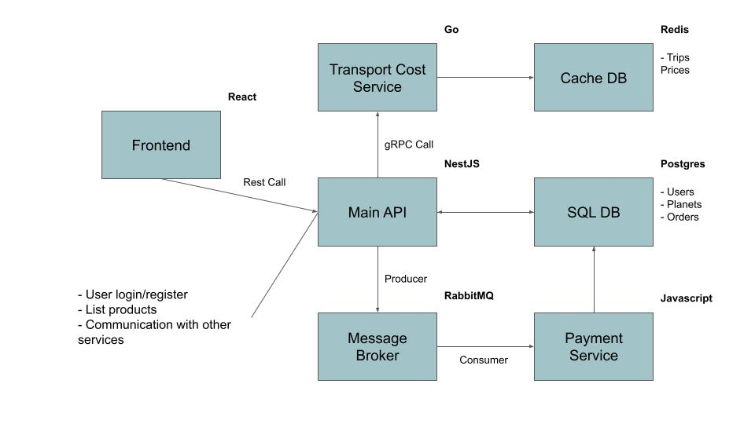

<h1 align="center" style="display:flex;align-items:center;justify-content:center;">
E-Cosmmerce
</h1>

<p  align="center">
  

  <a  href="https://github.com/LuanSilveiraSouza/ecosmmerce/commits/master">
    
  </a>

  
</p>

# :pushpin: Sumary

* [Introduction](#paperclip-introduction)
* [Technologies](#computer-technologies)
* [How to Run](#rocket-how-to-use)
* [Contribution, Bugs and Issues](#bug-contribution-bugs-and-issues)
* [License](#books-license)

# :paperclip: Introduction

E-Cosmmerce is a E-Commerce platform to buy trips to planets around the Cosmos :ringed_planet:




# :computer: Technologies


# :rocket: How to Run

```bash

# Install protobuf compiler and go plugin by following this tutorial: https://grpc.io/docs/languages/go/quickstart/
$ protoc -I=proto/ --go_out=./transport-service --go-grpc_out=./transport-service proto/transport.proto

```

# :bug: Contribution, Bugs and Issues

Feel free to open new issues and colaborate with others issues in [E-Cosmmerce Issues](https://github.com/LuanSilveiraSouza/ecosmmerce/issues)

# :books: License

Released in 2020 under [MIT License](https://opensource.org/licenses/MIT)

Made with :heart: by Luan Souza.
